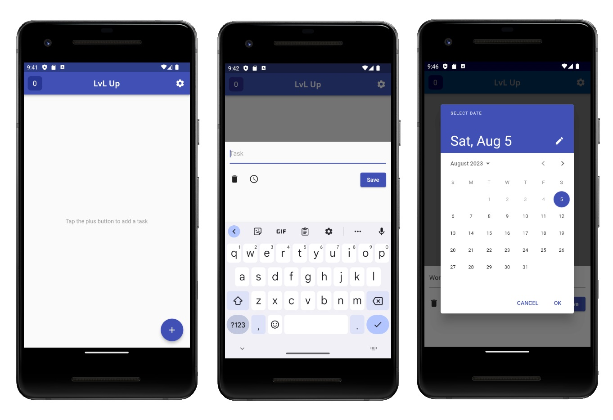
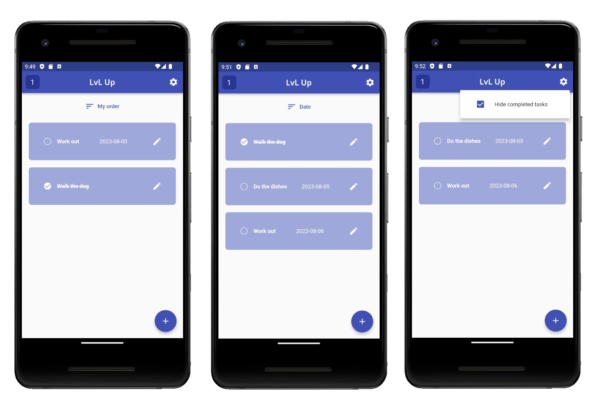

# LvL Up

Welcome to the LvL Up app!

This is a fully functional to do list app with gamification features.

Its main inspiration was Google Tasks, an app that I use daily, but in which some functionalities
were lacking in some way for me. The features I would have loved to see in such app were mainly two:
being able to have a personal order for the tasks even when you select to sort them by date, and
being able to hide completed tasks instead of accumulating them in a separate section.

So I tried to recreate something similar to Google Tasks but incorporating these features. But then
I started thinking what else I would like to see in a to do list app. What if completing tasks could
be gamified? And from that LvL Up was born! A full fledged to do list app, which this is just a
prototype of, which would have all sorts of gamification features. For now, the only feature of this
sort that I incorporated is that completed tasks give you points. Below there's a full list of the
features of this version of the app.

https://github.com/brunofreda/lvl-up/assets/47567054/c5a5e6d4-e122-42f6-8d84-81280c60c1ab

## Features

- Task list viewer in form of tiles with a hint text whenever there's no tasks added
- Floating button to add tasks
- The floating button opens a dialog box in which to type the name of the task, pick a date (which
  is shown in the dialog box), and save or discard the task
- Calendar type selector for picking a date
- A confirmation dialog box whenever the discard button is pressed
- Task tiles with a check button to indicate the task has been completed (which lines through the
  task's name or hides it depending on the settings of the user) and an edit button
- Adding a task shows a button to sort them by personal order by dragging them or by date
- The edit button opens a dialog box with the same buttons of the dialog box for adding tasks but
  showing the selected task's data
- A settings button to choose whether to hide completed tasks or not
- A score counter which adds a point with each task completed
- The data is saved in the local storage

## Some of the things the full app would have

Client side

- Title logo
- Icon next to the score counter
- Other useful features (a calendar, events, notes, objectives, and more)
- Homepage with stats and thumbnails of the pages of the other features which link you to those
  pages
- The pages can be also accesed by dragging to the right or to the left
- If the completed tasks are not set to be hidden, they are set aside in a list of their own down
  below
- Multiple date formats to choose from
- Tasks with dates set to today or tomorrow would show "today" or "tomorrow" respectively instead
  of the date
- The sort by date option would subdivide the tasks in little groups corresponding to each day
- When sort by date is selected, the tasks without date would stay at the bottom of the list instead
  of on the top
- The option to add multiple tasks pages
- Themes
- The tiles could be chosen to be shown in a gradient of color relative to their position in the
  list to represent their priority in time
- A customizable profile with gamification features, such as level of user, milestones, items, more
  themes, all of which would be related to the score and objectives set by the user
- Improving some of the graphics and transitions
- Store the data in your account, which would be synced with the webapp

Code design

- Improve the general readability of the code (right now the order of variables and methods
  coincides with the expected typical flow of usage of the app)
- Maybe use a Map to store the tasks data instead of a List
- Make each page an instance of a class called "Page" that contains at least the AppBar
- Check which class fields (if any) are set as "required" but shouldn't be
- Check which variables, functions or classes aren't private and should be
